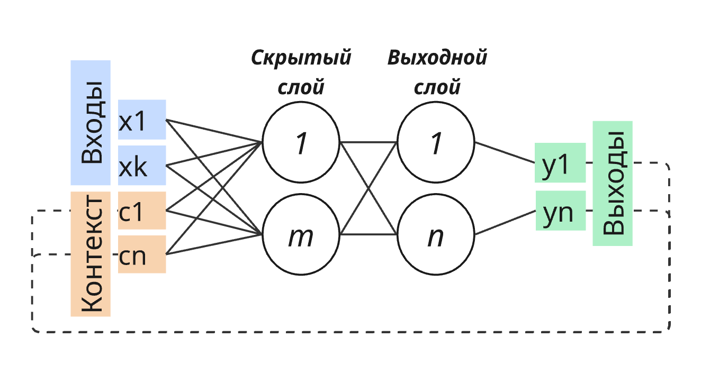

# Нейронная сеть Джордана
## 1. Структура
- Входы: `k` значений
- Контекст: `n` значений
- Скрытый слой: `m` нейронов
- Выходной слой: `n` нейронов

## 2. Обозначения
- $\vec x$ — значения входа `[k × 1]`
- $\vec c$ — значения контекста `[n × 1]`
- $\vec S_H$ — состояния нейронов скрытого слоя `[m × 1]`
- $f_H(S)$ — функция активации нейронов скрытого слоя 
- $\vec h$ — значения выходов нейронов скрытого слоя `[m × 1]`
- $\vec S_O$ — состояния нейронов выходного слоя `[n × 1]`
- $f_O(S)$ — функция активации нейронов выходного слоя 
- $\vec y$ — значения выходов нейронов выходного слоя `[n × 1]`

*Матрицы весов*:
- $W_{IH}$ — веса связей между входами и нейронами скрытого слоя `[m × (k+1)]*`
- $W_{CH}$ — веса связей между контекстом и нейронами скрытого слоя `[m × n]`
- $W_{HO}$ — веса связей между нейронами скрытого и выходного слоёв `[n × (m+1)]*`

> \* – помимо кол-ва нейронов в слое учитывается фиктивный вход

## 3. Алгоритм прямого распространения сигнала

1. Расширяем вектор значений входов, добавляя единицу в начало вектора:
$$\vec{\tilde{x}} = [1, \vec x]^T$$
2. Рассчитываем состояния нейронов скрытого слоя: 
$$\vec S_H = W_{IH} \cdot \vec{\tilde{x}} + W_{CH} \cdot \vec c$$
3. Рассчитываем значения выходов нейронов скрытого слоя:
$$\vec h = f_H(\vec S_H)$$
4. Расширяем вектор значений выходов нейронов скрытого слоя, добавляя единицу в начало вектора:
$$\vec{\tilde{h}} = [1, \vec h]^T$$
5. Рассчитываем состояния нейронов выходного слоя: 
$$\vec S_O = W_{HO} \cdot \vec{\tilde{h}}$$
6. Рассчитываем значения выходов нейронов выходного слоя:
$$\vec y = f_O(\vec S_O)$$

## 4. Алгоритм расчёта поправок весов

> Технически, логика повторяет алгоритм обратного распространения ошибки, так как сеть представляет собой двуслойный перцептрон с добавлением контекста.

Пусть дан обучающий пример:
- $\vec x$ — значения входов примера
- $\vec y_{пр}$ — значения выходов примера

Значения весовых коэффициентов ($W_{IH}, W_{CH}, W_{HO}$), контекста ($\vec c$), а также коэффициента скорости обучения ($v$) должны быть определены заранее.

1. Рассчитываем выходы сети по алгоритму прямого распростронения сигнала — $\vec y$ `(см. 3)`.
2. Рассчитываем вектор значений ошибок выходов сети относительно обучающего примера:
$$\vec\Delta = \vec y_{пр} - \vec y$$
3. Рассчитываем значения невязок нейронов выходного слоя:
$$\vec\delta _O = \vec\Delta \odot f_O'(\vec S_O)$$
4. Рассчитываем значения невязок нейронов скрытого слоя:
$$\vec\delta _H = (W_{HO} \cdot \vec\delta _O) \odot f_H'(\vec S_H)$$
5. Рассчитываются поправки весовых коэффициентов:
$$\Delta W_{IH} = v \cdot (\vec\delta _H \cdot \vec{\tilde{x}}^T),$$
$$\Delta W_{СH} = v \cdot (\vec\delta _H \cdot \vec с^T),$$
$$\Delta W_{HO} = v \cdot (\vec\delta _O \cdot \vec{\tilde{h}}^T),$$
где $\vec{\tilde{x}}, \vec{\tilde{h}}$ — расширенные векторы значений входов примера и выходов нейронов скрытого слоя `(см. 3.1, 3.4)`