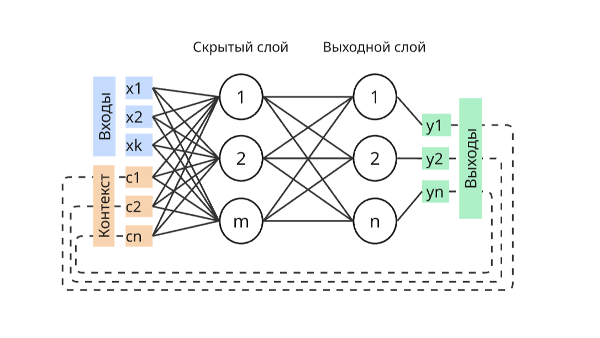

# Нейронная сеть Джордана

- Входной слой `x`: `k` нейронов + фиктивная единица
- Скрытый слой `h`: `m` нейронов + фиктивная единица
- Выходной слой `y`: `n` нейронов.
- Контекстный слой `c`: `n` нейронов (размер равен выходному слою)

Матрицы весов:

- $W^{IH}$ — веса от Входа (Input) к Скрытому (Hidden) слою. Размер: `(m, k+1)`
- $W^{CH}$ — веса от Контекста (Context) к Скрытому (Hidden) слою. Размер: `(m, n)`
- $W^{HO}$ — веса от Скрытого (Hidden) слоя к Выходу (Output). Размер: `(n, m)`

## Алгоритм НС Джордана

1. Инициализация
   - Инициализируем матрицу весов $W$ для слоев, небольшими случайными числами (из нормального распределения)
   - Инициализируем контекстный слой $c$ с нулевыми значениями размерностью

2. Прямое распространение
   - Рассчитываем состояния $S$ и выходы $h$ нейронов для скрытых слоев. 

   $$S_i = W_{i0} + \sum_{j=1}^{k}{W^{IH}_{ij}x_j} + \sum_{j=1}^n{W^{CH}_{ij}c_j}$$
   $$h_i = \sigma(S_i)$$

   - 

- Копируем значения выходов из выходного слоя в контекстный `C`

   $$C_j = y_{j}$$

[//]: # (3. $$S_i = W_{i0} + \sum_{j=1}^n{W_{ij}S_i} + \sum_{j=1}^{k}{W_{ij}C_j}$$)

[//]: # ()
[//]: # ()
[//]: # (4. Рассчитываем состояния `S` нейронов и их выходы `y`)

[//]: # ()
[//]: # ()
[//]: # (   $$S_i = W_{i0} + \sum_{j=1}^n{W_{ij}x_j}$$)

[//]: # ()
[//]: # (   $$y_i = f&#40;S_i&#41;$$)

5. Методом обратного распространения ошибки, рассчитываем невязки $\delta{}$

   $$\delta_{j} = \Delta_{j} * f'(S_j)$$

   $$\delta_{i} = (\sum_{j = 1}^m{W_{ij}\delta_{j}}) * f'(S_i)$$

6. Перерасчитываем значения весовых коэффициентов
