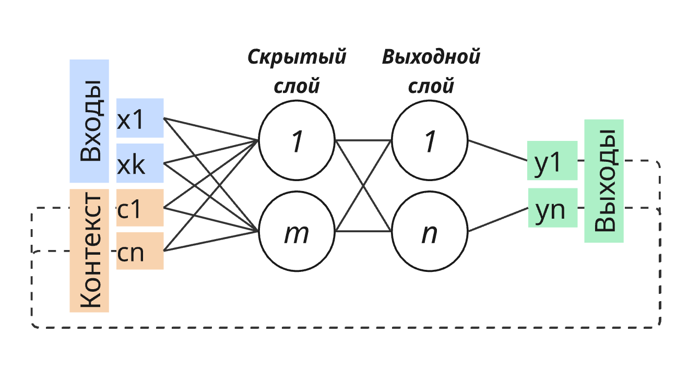

# Нейронная сеть Джордана

## 1. Структура
- Входы: `k` значений
- Контекст: `n` значений  
- Скрытый слой: `m` нейронов
- Выходной слой: `n` нейронов

 

 

## 2. Обозначения

- $\vec{x}$ — значения входа `[k × 1]`
- $\vec{c}$ — значения контекста `[n × 1]`
- $\vec{S_H}$ — состояния нейронов скрытого слоя `[m × 1]`
- $f_H(S)$ — функция активации нейронов скрытого слоя 
- $\vec{h}$ — значения выходов нейронов скрытого слоя `[m × 1]`
- $\vec{S_O}$ — состояния нейронов выходного слоя `[n × 1]`
- $f_O(S)$ — функция активации нейронов выходного слоя 
- $\vec{y}$ — значения выходов нейронов выходного слоя `[n × 1]`

 

**Матрицы весов**:

- $W_{IH}$ — веса связей между входами и нейронами скрытого слоя `[m × (k+1)]*`
- $W_{CH}$ — веса связей между контекстом и нейронами скрытого слоя `[m × n]`
- $W_{HO}$ — веса связей между нейронами скрытого и выходного слоёв `[n × (m+1)]*`

> \* – помимо кол-ва нейронов в слое учитывается фиктивный вход

 

## 3. Алгоритм прямого распространения сигнала

1. Расширяем вектор значений входов, добавляя единицу в начало вектора:

 

$$
\vec{\tilde{x}} = [1, \vec{x}]^{T}
$$

 

2. Рассчитываем состояния нейронов скрытого слоя:

 

$$
\vec{S_H} = W_{IH} \cdot \vec{\tilde{x}} + W_{CH} \cdot \vec{c}
$$

 

3. Рассчитываем значения выходов нейронов скрытого слоя:

 

$$
\vec{h} = f_H(\vec{S_H})
$$

 

4. Расширяем вектор значений выходов нейронов скрытого слоя, добавляя единицу в начало вектора:

 

$$
\vec{\tilde{h}} = [1, \vec{h}]^{T}
$$

 

5. Рассчитываем состояния нейронов выходного слоя:

 

$$
\vec{S_O} = W_{HO} \cdot \vec{\tilde{h}}
$$

 

6. Рассчитываем значения выходов нейронов выходного слоя:

 

$$
\vec{y} = f_O(\vec{S_O})
$$

 

## 4. Алгоритм расчёта поправок весов

### Алгоритм Обратного Распространения Ошибки Сквозь Время (BPTT)

Пусть дан обучающий пример — последовательность:
- $\vec{x}^{(t)}$ — значения входов на шаге $t$
- $\vec{y_{пр}}^{(t)}$ — целевые значения выходов на шаге $t$

 

**1. Прямое распространение сигнала (шаг $t$):**

 

$$
\begin{aligned}
\vec{h}^{(t)} &= f_H(\vec{S_H}^{(t)}) \\
\vec{S_H}^{(t)} &= W_{IH} \cdot \vec{\tilde{x}}^{(t)} + W_{CH} \cdot \vec{h}^{(t-1)} \\
\vec{y}^{(t)} &= f_O(\vec{S_O}^{(t)}) \\
\vec{S_O}^{(t)} &= W_{HO} \cdot \vec{\tilde{h}}^{(t)}
\end{aligned}
$$

 

**2. Вычисление ошибки на выходе (шаг $t$):**

 

$$
\vec{\Delta}^{(t)} = \vec{y_{пр}}^{(t)} - \vec{y}^{(t)}
$$

 

**3. Обратное распространение через время:**

 

**3.1. Невязка выходного слоя:**

 

$$
\vec{\delta_O}^{(t)} = \vec{\Delta}^{(t)} \odot f_O'(\vec{S_O}^{(t)})
$$

 

**3.2. Невязка скрытого слоя:**

 

$$
\vec{\delta_H}^{(t)} = f_H'(\vec{S_H}^{(t)}) \odot \left[ W_{HO}^T \cdot \vec{\delta_O}^{(t)} + W_{CH}^T \cdot \vec{\delta_H}^{(t+1)} \right]
$$

 

> **Примечание:** Для последнего шага последовательности ($t = T$) принимаем $\vec{\delta_H}^{(T+1)} = \vec{0}$

 

**4. Вычисление градиентов весов:**

 

**4.1. Для весов $W_{HO}$ (выходной слой):**

 

$$
\Delta W_{HO} = \eta \cdot \sum_{t=1}^{T} \left[ \vec{\delta_O}^{(t)} \cdot (\vec{\tilde{h}}^{(t)})^T \right]
$$

 

**4.2. Для весов $W_{IH}$ (вход → скрытый слой):**

 

$$
\Delta W_{IH} = \eta \cdot \sum_{t=1}^{T} \left[ \vec{\delta_H}^{(t)} \cdot (\vec{\tilde{x}}^{(t)})^T \right]
$$

 

**4.3. Для весов $W_{CH}$ (контекст → скрытый слой):**

 

$$
\Delta W_{CH} = \eta \cdot \sum_{t=1}^{T} \left[ \vec{\delta_H}^{(t)} \cdot (\vec{h}^{(t-1)})^T \right]
$$

 

**5. Обновление весов:**

 

$$
\begin{aligned}
W_{HO} &\leftarrow W_{HO} + \Delta W_{HO} \\
W_{IH} &\leftarrow W_{IH} + \Delta W_{IH} \\
W_{CH} &\leftarrow W_{CH} + \Delta W_{CH}
\end{aligned}
$$

 

### Пояснения к обозначениям:

- $\vec{\tilde{x}}^{(t)}, \vec{\tilde{h}}^{(t)}$ — расширенные векторы (с добавленным смещающим нейроном)
- $f_H, f_O$ — функции активации скрытого и выходного слоёв
- $f_H', f_O'$ — производные функций активации
- $\odot$ — поэлементное умножение (произведение Адамара)
- $\eta$ — коэффициент скорости обучения
- $T$ — длина последовательности (количество шагов по времени)