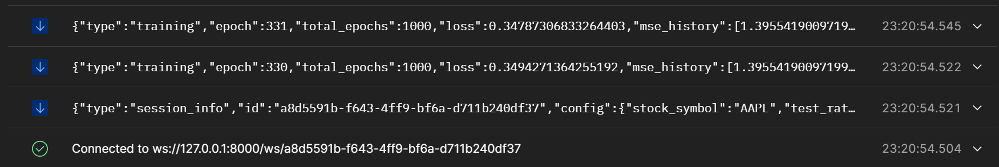

# Документация к вебсокетам

## URL для подключения: `ws://127.0.0.1:8000/ws/{session_id}`

При подключении должен сразу отдавать данные об эпохах, иначе запуска обучения не было или неправильный session_id

Должно это выглядеть так



### Схема для получения данных вебсокета

```shell
{
    "type": "training",
    "epoch": int,        # Текущая эпоха обучения
    "total_epochs": int, # Количество эпох обучения
    "loss": float        # Текущая ошибка
    "mse_history": list[float]  # История ошибок
}
```

### Работа с вебсокетами

Чтобы остановить обучение необходимо отправить json

```shell
{
  "action": "stop" # Без возможности запустить снова
}
```

Чтобы приостановить обучение необходимо отправить json

```shell
{
  "action": "pause"  # Есть возможность продолжить обучение
}
```

```shell
{
  "action": "resume"  # Продолжает обучение
}
```